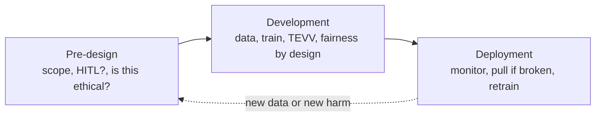
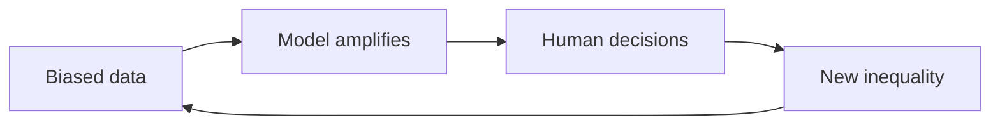
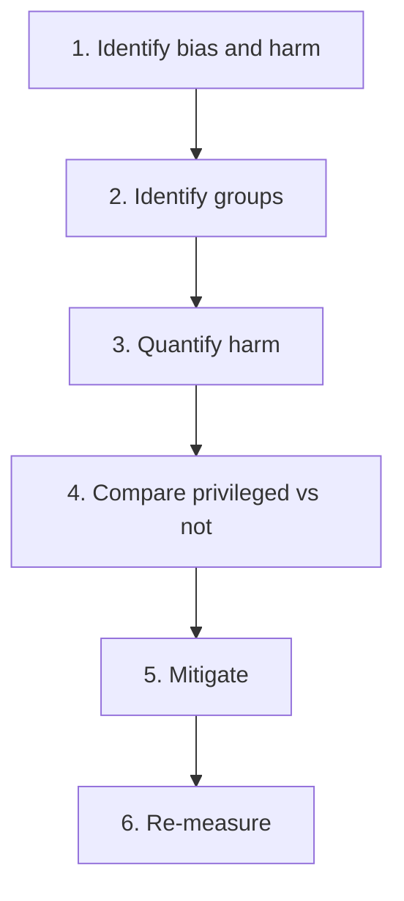

# Ethical AI

My study notes, drafted with AI and then edited by me. Written so the ideas stand on their own. Not a course transcript, and not a substitute for one.

Numbers, dates, and legal sketches are study examples as they appeared in lessons I used. The diagrams were added when these notes were written. Laws and benchmarks change; fairness metrics are definitions with common interpretations, not universal rules.

---

## 1. What ethical AI is

**Artificial intelligence (AI):** systems that analyze their environment and act with some autonomy toward a goal (European Union definition used in the lessons). Software-only or embedded in hardware. More autonomy means more ethical burden.

**Machine learning (ML):** algorithms that find patterns in data. **Deep learning:** ML with multi-layer neural networks. **Generative AI (GenAI):** models that produce text, images, audio, or video. **Large language models (LLMs):** GenAI trained to predict the next token.

**Ethical AI** = principles + practices + processes, applied by a multidisciplinary team. Data in, model runs, a decision affects people.

| Layer | Examples |
|---|---|
| Principles | Fairness, transparency, security, privacy (add accessibility if that is the product) |
| Practices | Metrics, toolkits, human-in-the-loop, documentation |
| Processes | Boards, impact assessments, audits, change management |

**Autonomy (common examples, not a ranking of every use case)**

| Mode | Meaning | Typical example |
|---|---|---|
| Human out of the loop (HOTL) | No person in the decision | Game AI |
| Human in the loop (HITL) | A person can inspect or override | Medical imaging, credit |
| Limited or no AI | Automation may be the wrong tool | Recidivism scoring, access to employment |

Related thought experiment: the **trolley problem**. Other failures are about power: surveillance, autonomous weapons, deepfakes.

**Four pillars**

| Pillar | Means | If it fails |
|---|---|---|
| Fairness | Just outcomes across the people affected | Discrimination, lawsuits, brand damage |
| Transparency | How a decision was made and who is accountable | Hard to debug or comply |
| Security | Resist attack and misuse | Harm, downtime |
| Privacy | Protect medical, financial, location, and similar data | Breach, leaked prompts |

**Why organizations care (figures cited in the lessons, dated):** executives ranking AI ethics as important, under 50% (2018) to about 75% (2021); AI-related bills passed, 1 (2016) to 37 (2022) across 127 countries; 42% of companies using AI concerned about brand damage from bias (2019 DataRobot report). Return on investment (ROI) depends on trust. You do not need to be an ML engineer: spot a principle being violated, know input-process-output, ask what happens at each lifecycle stage, design for all target users.

**Stakeholders:** business, engineers, auditors, civil society, researchers, governments, end users, and people affected who never opted in.

---

## 2. Lifecycle

Ethics belongs in every stage.



**Test, evaluation, validation, and verification (TEVV):** measured evidence, not intuition.

**Call-center voice stack (running example):** speech-to-text, intent, named-entity recognition (NER), generate, text-to-speech (TTS). Ethics in that stack: dialect coverage, tell the user it is a bot, block harmful replies, third-party leakage, human takeover on failure.

Organization overlay: principles at strategy, guardrails and vetting in build, monitoring in production.

---

## 3. Bias: types, sources, harms

National Institute of Standards and Technology (NIST) sources:

| Source | Question | Common example |
|---|---|---|
| Systemic | Who holds power? | Institutional racism or sexism in the data |
| Computational | Who is counted? | Young training set, older user at deploy |
| Human / cognitive | What do we want to see? | Confirmation bias in labeling or ignoring the model |

A dataset can describe the past accurately and still be biased (historical pay-gap data).

### Types (common examples)

| Type | Mechanism | Common example |
|---|---|---|
| Historical | Past injustice in labels | Older income data disadvantages women |
| Selection | Sample does not match the population | LLM trained on academic English fails on colloquial speech |
| Sampling / non-response | Groups never enter the file | Survey skippers vanish |
| Confirmation | Keep what fits a worldview | Clinician discards a correct AI diagnosis |
| Label | Annotator culture | Same image tagged painting or picture |
| Measurement | Bad sensor or annotation | Faulty medical device |
| Evaluation | Test set does not match the world | Tool built in one jurisdiction, used in another |
| Aggregation | One model, many cultures | Lyrics labeled as aggression |
| Deployment | Used off-label | Home speech model used as a biometric lock |

**Harms (Kate Crawford):** **allocation** (loan, job, risk score given or denied) and **quality of service** (same product, worse accuracy for some users). NIST also: harm to people, organizations, and systems.

Fairness is **context-dependent**. A game bot and a hiring model are not the same obligation. Urgency follows risk and harm.

**Negative feedback loop:** biased data, model amplifies, humans over-trust or over-reject, new inequality, worse data. Lesson example: cooking photos already more often showed women (about 33%); the model then predicted woman-in-kitchen about 68% of the time.



### Case studies (one line each; numbers as cited in the lessons)

- **COMPAS** (Correctional Offender Management Profiling for Alternative Sanctions): recidivism tool; ProPublica reported higher false high-risk scores for Black defendants and more low-risk labels for white re-offenders; vendor claimed equal accuracy (different metrics, different verdict); features not disclosed.
- **Allegheny Family Screening:** many poverty proxies among 131 indicators; higher referral rates for Black families; Oregon variant shut down.
- **Soap dispensers / computer vision:** near-infrared (NIR) sensors and image labels failed on darker skin; often fixed after release.
- **Pain medication / facial benchmarks:** cited disparities in emergency-department treatment and under-representation of dark-skinned women in common face datasets.
- **Hiring video and mortgage scoring:** face/voice scoring and gender (or a proxy) can reproduce historical bias.

---

## 4. Fairness pipeline

**Fairness:** just treatment without discrimination. Two common framings:

| Kind | Claim | Typical limit |
|---|---|---|
| Individual | Similar people, similar treatment | Hard to operationalize |
| Group | Comparable benefit across groups | Easier to code; metrics can conflict; people inside a group can still be harmed |



**Vocabulary (AI Fairness 360 / AIF360):** protected attribute (gender, race, religion, and similar); privileged / unprivileged group; favorable label (the benefit, for example `good_credit = 1`). How you split groups and what you treat as the target are value choices. True repayment is not the same as a loan-officer decision. Missing demographic columns does not remove the fairness question.

---

## 5. Measure

**Class imbalance:** some groups or labels dominate (measurement, selection, sampling, non-response).

**Proxy variables (common examples):** zip or city for race; per-capita gross domestic product (GDP) for living standard; public-service use for poverty. Dropping the sensitive column does not remove the proxy.

### Confusion matrix

```
                 Predicted +          Predicted −
Actual +         TP                   FN
Actual −         FP                   TN
```

Which error hurts whom depends on the use case. A common medical example: false negative (FN) means missed disease. A common justice example: false positive (FP) means extra punishment.

| Metric | Formula | Meaning |
|---|---|---|
| False positive rate (FPR) | FP / (FP + TN) | False alarms among actual negatives |
| False negative rate (FNR) | FN / (FN + TP) | Misses among actual positives |
| Positive predictive value (PPV) | TP / (TP + FP) | Of predicted positives, how many are real |
| False discovery rate (FDR) | FP / (FP + TP) | Of predicted positives, how many are wrong |
| True positive rate (TPR, sensitivity) | TP / (TP + FN) | Catch rate |
| True negative rate (TNR, specificity) | TN / (TN + FP) | Correct-reject rate |
| Balanced accuracy | (TPR + TNR) / 2 | Often preferred when classes are imbalanced |

FPR divides by actual negatives. FDR divides by predicted positives.

### Group fairness (common toolkit interpretations)

Let Ŷ = 1 be the favorable prediction. These are **typical** readings in AIF360 / Fairlearn, not laws of nature. Ideal values and "who is favored" flip if you swap which group is labeled privileged.

| Metric | What | Typical ideal | Common reading if off-ideal |
|---|---|---|---|
| Statistical parity difference (SPD) | P(Ŷ=1 \| unprivileged) − P(Ŷ=1 \| privileged) | 0 | Privileged group getting more of the benefit (if SPD < 0 with this sign) |
| Disparate impact (DI) | P(Ŷ=1 \| unprivileged) / P(Ŷ=1 \| privileged) | 1 | DI < 1 often read as privileged group favored |
| Equal opportunity (EO) | Equal FNR (hence equal TPR) | 0 difference | Same directional reading as SPD in the lesson demos |
| Equalized odds | Equal TPR and equal FPR | both match | Stricter than equal opportunity |
| Theil index | Inequality (individual + group) | 0 | Unfairness somewhere in the distribution |

**Walkthrough (German credit demo):** sex as protected attribute, men privileged; SPD negative and DI below 1 before reweighing, near ideal after. Treat those numbers as a lab example, not a published benchmark.

**Calibration (definition):** if 100 people have predicted probability 0.6, about 60 should be positive.

**Nuance (phrase as common results, not absolute rules)**

- Statistical parity can require different thresholds by group. A common loan example: if one group repays more often, equal grant rates may mean loosening the bar for the other group. That may or may not be the fairness you want.
- Equalized odds assumes a trustworthy target. If the label is already a biased human decision, you are equalizing that process.
- A common teaching point: calibrated probabilities and equalized odds cannot both hold. Calibrated equalized-odds post-processing matches one cost (for example FNR) while keeping calibration.
- Improving one fairness metric often worsens another. Report a set of scores. **Stratify** by group rather than quoting only overall accuracy.

**Tools used in the lessons:** AIF360, Fairlearn, RAGAS, DeepEval; production monitors such as Fiddler and Arize.

---

## 6. Mitigation

Common framing: **constrained optimization** (minimize error subject to a fairness bound). Accuracy and equity can move in opposite directions.


| Stage | Method taught | Idea | Typical limit |
|---|---|---|---|
| Pre | Reweighing (AIF360) | Heavier weights on unprivileged + favorable (and the reverse) | Policy choice; may reduce accuracy |
| Pre | Correlation remover (Fairlearn) | Strip correlation between sensitive and non-sensitive features | May reduce accuracy |
| In | Adversarial debiasing | Maximize accuracy while an adversary fails to predict the sensitive attribute from Ŷ | Extra complexity |
| Post | Calibrated equalized odds | Adjust labels to hit one equalized-odds cost | Other metrics can get worse |

Other options discussed: newer data; hide sensitive attributes (proxies remain); more complex models (less interpretable); **change the target**.

```python
from aif360.algorithms.preprocessing import Reweighing
from aif360.metrics import BinaryLabelDatasetMetric

priv, unpriv = [{'sex': 1}], [{'sex': 0}]
rw = Reweighing(unprivileged_groups=unpriv, privileged_groups=priv)
fixed = rw.fit_transform(data)
# Then recompute SPD / DI. In the demo they moved toward 0 and 1.
```

**Fairness by design:** diverse teams early, annotation guidelines, check representativeness, decide which proxies to keep, measure on a schedule.

**Production:** you often lack labels and demographics. Monitor drift anyway. Pull or retrain if it fails.

---

## 7. Transparency, trust, explainability

Trust needs more than a single score. Lesson contrast: a skin-health app that only outputs a diagnosis vs one that also shows drivers, known failure modes, and who can see the photos.

**Interpretability:** a person can follow why the output happened. Foundation models make this hard (scale, vendor secrecy, sampling, hallucinations, emergent behavior).

| XAI method | How it works |
|---|---|
| Inherently interpretable | Decision trees, linear models, rubrics |
| Permutation importance | Shuffle a feature; score drop shows dependence |
| **LIME** (Local Interpretable Model-agnostic Explanations) | Perturb one row, fit a local linear model. Needs predictions only |
| Counterfactuals | What would have to change for the other label? |
| Show-your-work | Decompose the task (tax form, essay rubric) |

**Model cards** (Mitchell and colleagues): short report covering model details, intended use and **out of scope**, factors and metrics, data, stratified quantitative analysis, ethical considerations, caveats.

**Data governance:** quality and integrity (including **provenance**); security as confidentiality, integrity, availability (CIA); compliance metrics such as missingness, representativeness, records purged.

**Auditing:** stratified, reproducible, documented.

**Law as summarized in the lessons (verify against current text; not legal advice)**

| Instrument | How the materials used it |
|---|---|
| **GDPR** (General Data Protection Regulation) | Binding EU data-protection law. Controllers vs processors; encryption; pseudonymization; restore availability; test controls. Location of deployment matters. |
| US **Commercial Facial Recognition Privacy Act** | A bill **introduced** in the Senate, used as an example: document limits, get consent, no discriminatory or unforeseeable use. Not presented as enacted law. |
| **CFPB** (Consumer Financial Protection Bureau) | Lesson summary: lenders using AI for credit denials should give specific reasons. |

---

## 8. Governance and organization

**Four-level risk scheme taught** (European Commission AI regulation / EU AI Act framing in the lessons):

| Level | Rule (as taught) | Common example |
|---|---|---|
| Unacceptable | Banned | Government social scoring |
| High | Mandatory requirements before market | Hiring, education access, biometrics |
| Limited | Transparency | User must know it is a chatbot |
| Minimal | Free use | Spam filters |

A resume *screening* system and an internal retrieval chatbot are not the same risk.

**Governance vs policy vs public good:** governance is process for responsible use (including when it fails). Public policy is what governments do; it is not automatically the public good. Public good here: no civil or human-rights harm. Affected people should be in the process.

| Body | Role as cited |
|---|---|
| OECD (Organisation for Economic Co-operation and Development) | Large database of national AI policy initiatives; value-based principles |
| Council of Europe | Legal framework vs human rights, democracy, rule of law |
| ISO/IEC | Manageability and certification processes |

Public-setting pillars: transparency, accountability, fairness, safety (including human oversight). Analogy used: AI is the tire; a skilled driver is still required.

**Inside a company:** map values to principles (board or multidisciplinary group); guardrails; vet tools; escalation path; change management. Diversity, equity, and inclusion (DEI) is part of risk control.

**How to house AI:** who owns resources, who allocates, who approves funding, who owns strategy.

| Model | Pattern |
|---|---|
| Decentralized | Business units (BUs) invent AI alone |
| Centralized | One group owns every project |
| Federated | BUs execute; a central function sets guardrails (usual mature form) |

Once AI is strategic, it belongs at **C-suite** level, like finance or information technology (IT).

**Human capital (core, not a full org chart):** involve executives, delivery, business subject-matter experts (SMEs), IT, and external customers. Typical technical bench: ML / GenAI / prompt / data / software roles. Two roles stressed: **analytics translator** (business-to-technical, often already on staff) and early **generalist** for a proof of concept (PoC). Upskill before hiring out. Soft skills still matter.

---

## 9. Accessibility

**Accessibility:** people with a wide range of abilities can use the product well. Designers miss them when they assume a default able body.

**Curb-cut effect:** design for disabled users often helps everyone (sidewalk cuts; one-handed phone use).

**Disability dongle** (Liz Jackson): an elegant product for a problem the community did not ask for. Common example: stair-climbing wheelchair vs ramps and elevators. Involve disabled people; do not invent for them.

Two jobs: make a general product usable (self-driving car), or build an accessibility-specific tool (Be My AI). Do not confuse them.

| Example | Point to remember |
|---|---|
| Automatic captions | On-demand access; errors and accent/language gaps; Communication Access Real-time Translation (CART) can still be more accurate |
| Be My AI | Instant visual Q&A; privacy (sensitive images, bystanders) and hallucinations |
| Self-driving | Independence if you cannot drive; 2018 Elaine Herzberg crash used to show misclassification risk (bike and bags; wheelchair plus backpack as a follow-on question) |

**Data / outputs / representation:** check whether disability is in the set. Cited examples: Joy Buolamwini adding dark-skinned women to face data; classifiers worse on photos from blind photographers; ventilator speech vs typical automatic speech recognition (ASR). Match output modality to the user (sign in, speech out is still a barrier). Generated "disabled person" images often collapse to a sad man in a wheelchair.

---

## 10. Generative AI

Black box: scale, secrecy, sampling, emergence. **Hallucination:** fluent output with no factual basis (invented legal citations are a common warning).

| Term | Meaning |
|---|---|
| Disinformation | False, intended to deceive |
| Misinformation | False, no intent required |

Mitigations taught: provenance, public literacy, evaluation before shipping, accountability. Also: energy and hardware cost, job displacement, inherited bias, training-data privacy, security, copyright and prompt leakage. Internal controls: **guardrails**, **risk assessments**, an escalation board.

### Retrieval-augmented generation (RAG)

Retrieve documents, then generate from them. Measure the index as well as the generator.

```
question → retrieve k chunks → augment prompt → generate
recall@k  = relevant_retrieved / relevant_in_corpus
precision@k = relevant_retrieved / k
```

Raising **k** helps recall, not precision.

**Mango Oasis exercise (example scores, not industry standards):** context precision 83%, context recall 78%, faithfulness 85%, answer relevance 79%, geographic bias in 10% of test cases. Lesson target discussed: about 85%+ on faithfulness and similar quality metrics. Traditional key performance indicators (KPIs) miss nondeterminism and harm.

Operate with diverse data, regular RAGAS / DeepEval checks, user feedback, A/B tests, and domain experts.

**Workforce (high level):** tools can raise productivity quickly; routine slices of jobs shrink first; keep HITL on decisions that create liability; collect concrete use cases rather than a slogan.

---

## 11. Checklist

**Before you build:** right tool (HITL / HOTL / none); who is harmed on FN vs FP; out-of-scope uses on a model card; disabled users in the problem, not a dongle.

**Data:** class balance plotted; proxies listed; provenance, consent, purge, encryption.

**Model:** SPD, DI, and EO (or a stated alternative set) by group, not only accuracy; mitigate and re-measure; explain failures (LIME, permutation).

**Ship:** model card a product manager can read; user knows it is AI if that is the risk bar; monitor without labels; kill switch and retrain plan.

**Organization:** named executive; federated execution plus central guardrails; escalation path; translator in the room; third-party tools vetted to your bar.

---

## Abbreviation index

| Short | Full |
|---|---|
| AI | artificial intelligence |
| AIF360 | AI Fairness 360 |
| ASR | automatic speech recognition |
| BU | business unit |
| CART | Communication Access Real-time Translation |
| CFPB | Consumer Financial Protection Bureau |
| CIA | confidentiality, integrity, availability |
| COMPAS | Correctional Offender Management Profiling for Alternative Sanctions |
| DEI | diversity, equity, and inclusion |
| DI | disparate impact |
| EO | equal opportunity |
| FDR / FNR / FPR | false discovery / negative / positive rate |
| FN / FP / TN / TP | false/true negative/positive |
| GDP | gross domestic product |
| GDPR | General Data Protection Regulation |
| GenAI | generative AI |
| HITL / HOTL | human in / out of the loop |
| ISO/IEC | International Organization for Standardization / International Electrotechnical Commission |
| IT | information technology |
| KPI | key performance indicator |
| LIME | Local Interpretable Model-agnostic Explanations |
| LLM | large language model |
| ML | machine learning |
| NER | named-entity recognition |
| NIR | near-infrared |
| NIST | National Institute of Standards and Technology |
| OECD | Organisation for Economic Co-operation and Development |
| PoC | proof of concept |
| PPV | positive predictive value |
| RAG | retrieval-augmented generation |
| ROI | return on investment |
| SME | subject-matter expert |
| SPD | statistical parity difference |
| TEVV | test, evaluation, validation, and verification |
| TNR / TPR | true negative / positive rate |
| TTS | text-to-speech |
| XAI | explainable AI |

